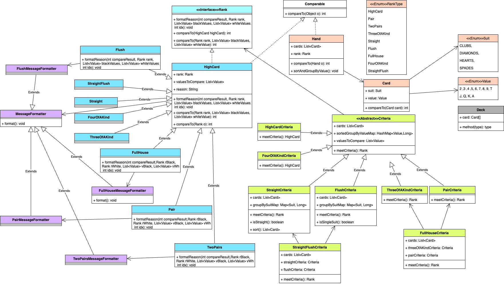

# Poker Hands

## Introduction
This is a simple program to compare several pairs of poker hands and to indicate which, if either, has a higher rankType.

## Technology
Java 17

## UML Diagram




## Key Notes
1. Used Criteria design pattern for deciding which Rank the hands of cards belong to.
2. Used SOLID Principle to avoid a list of if else
   * Single Responsibility breaks down the bulky Hand class to a list of Rank classes, Criteria classes and MessageFormatter class which have their own responsibilties
   * Open-Closed as the classes are broken down into smaller classes. They are closed for modification. But allow extension of other Rank type and different message format display.
   * Liskov as the derived child classes extending MessageFormatter, Rank and Criteria extend the base class without changing behavior
   * Interface segregation, interface are separated into smaller interface instead of a single bulky interface.   
   * Dependency Inversion, the attribute is depend on abstraction, not concretion. 
   ```java
    RandomCard random = new RandomCardImpl(); // in RandomMain
   ```
       
    ```java
    List<Criteria> criterias = new LinkedList<>();
    criterias.add(new StraightFlushCriteria(cards, sortedGroupByValueMap, straightCriteria, flushCriteria));
    ...

    for (Criteria criteria : criterias) {
        rank = criteria.meetCriteria();
        if (rank != null)
            break;
    }
    ```
3. Used stream map and collect in toString method in Hand class for converting the cards list to a string.
```java
public String toString() {
   return cards.stream()
   .map(String::valueOf)
   .collect(Collectors.joining(" ", "{", "}"));
   }
```
4. Used stream groupingBy for grouping the cards by count. Cards Value (2,3,4...K, A) is the key in the result map with their count as map value.
```java
    Map<Value, Long> groupByValueMap =
        cards.stream().collect(
            Collectors.groupingBy(
            Card::getValue, Collectors.counting()
            )
        );
```
5. Used stream & lambda for sorting the map in pt 4 by the count.
```java
    HashMap<Value, Long> sortedGroupByValueMap = new LinkedHashMap<>();

    groupByValueMap.entrySet().stream()
    .sorted(Map.Entry.<Value, Long>comparingByKey().reversed()) // sort by card's value desc
    .sorted(Map.Entry.<Value, Long>comparingByValue().reversed()) // sort by card value's count desc
    .forEachOrdered(e ->
    sortedGroupByValueMap.put(e.getKey(), e.getValue()));
    return sortedGroupByValueMap;
```
6. Used stream sort and collect for sorting in StraightCriteria class to sort the cards in list.
```java
    protected List<Card> sort() {
        return cards.stream()
                .sorted(Comparator.reverseOrder())
                .collect(Collectors.toList());
    }
```

7. Used stream to filter if the hand of cards matches "Two pairs" or "Pair" rank
```java
   public Rank meetCriteria() {
        List<Map.Entry<Value, Long>> pairList = sortedGroupByValueMap.entrySet()
        .stream()
        .filter(s -> s.getValue() == 2).toList();

        return switch (pairList.size()) {
        case 1 -> new Pair(valuesToCompare);
        case 2 -> new TwoPairs(valuesToCompare);
default -> null;
        };
        }
```

8. Used stream map and collect to convert an array of string to Card object list
```java
    this.cards = Arrays.stream(playerCardsArr)
        .map(Card::new)
        .collect(Collectors.toList());
```

9. Used stream filter on Enum to return the first matched symbol or else return null
```java
    public static Value getValueForSymbol(final char symbol)
    {
        return Stream.of(Value.values())
                .filter(s->s.symbol == symbol)
                .toList()
                .stream().findFirst().orElse(null);

    }
```
10. Used stream anyMatch to check if the card is already generated before
```java
private boolean hasConflict(Card card){
        return distributedCards.stream()
                .anyMatch(dc -> card.getValue().equals(dc.getValue()) && card.getSuit().equals(dc.getSuit()));
    }

```

## How to run unit test
```
mvn clean test
```

## How to launch
There are 2 ways to run the main.
1. Text UI which ask for user input, program will then ask for user to input 5 cards for black and 5 cards for white. Then it will evaluate the result.
```
mvn compile exec:java -Dexec.mainClass="main.Main"
```
2. Program randomly generate 5 cards for black and 5 cards for white. Then it will evaluate the result.
```
mvn compile exec:java -Dexec.mainClass="main.RandomMain"
```

## Approach
1. Compare 1 card  
2. Add a pair in comparison
3. Add two pairs in comparison
4. Add 3 of a kinds in comparison
5. Add straight in comparison
6. Add flush in comparison
7. Add full house in comparison
8. Add four of a kind in comparison
9. Add straight flush in comparison
10. Add handling of string input
11. Add main class

## Future Thoughts
1. Add GUI
